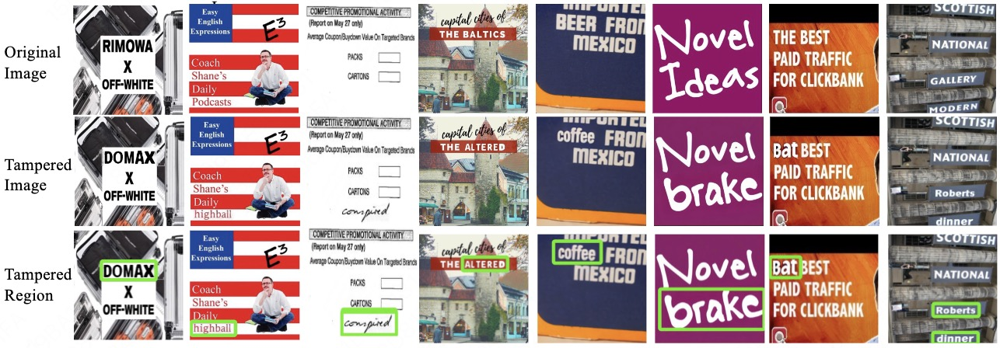

# RealDTT
RealDTT: Towards a Comprehensive Real-World Dataset for Tampered Text Detection

This dataset is designed for tampered text image research.

## Dataset Description

- **Source**: MARIO-LAION,ReCTS,LSVT,RCTW.
- **Type**: Generative text editing methods.
- **Size**: 399,592.
- **Format**: JPEG & PNG.

We will make the dataset download link publicly available shortly.
